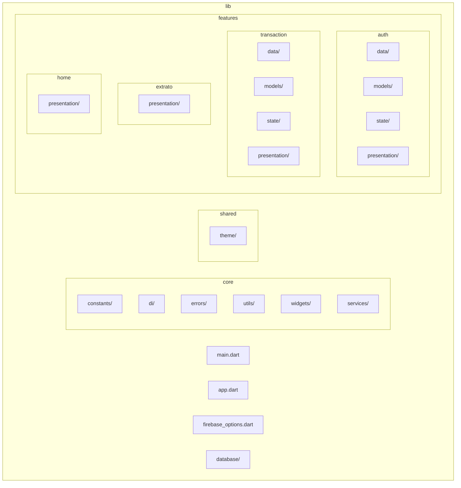

# Estrutura de pastas – Cortex Bank Mobile

**Quer uma versão curta?** Veja [LEIA-ME.md](LEIA-ME.md).

Este documento define a estrutura de pastas e convenções do projeto para manter o código **simples** e **robusto**. Para visão da arquitetura e guia de como desenvolver (novas features, telas, repositórios), veja [ARQUITETURA_E_DESENVOLVIMENTO.md](ARQUITETURA_E_DESENVOLVIMENTO.md).

---

## Princípios

1. **Feature-first** – O que pertence a uma funcionalidade fica dentro da feature.
2. **Core enxuto** – Só o que é usado por várias features ou pela app fica em `core/`.
3. **Poucos níveis** – Evitar muitas subpastas; preferir nomes claros.
4. **Consistência** – Todas as features seguem o mesmo padrão.

---

## Diagrama da árvore de pastas

### Visão hierárquica (Mermaid)



### Árvore completa (pastas e arquivos .dart)

```
lib/
├── main.dart
├── app.dart
├── firebase_options.dart
│
├── core/
│   ├── constants/
│   │   └── .gitkeep
│   ├── di/
│   │   └── injection.dart
│   ├── errors/
│   │   └── failure.dart
│   ├── utils/
│   │   ├── validators.dart
│   │   ├── safe_log.dart
│   │   ├── env_validator.dart
│   │   ├── firebase_error_translator.dart
│   │   ├── currency_formatter.dart
│   │   ├── result.dart
│   └── widgets/
│       ├── app_button.dart
│       ├── app_text_field.dart
│       ├── app_error_message.dart
│       ├── app_loading.dart
│       └── bottom_navigation.dart
│   └── services/
│       └── firebase_service.dart
│
├── shared/
│   └── theme/
│       ├── app_design_tokens.dart
│       └── app_theme.dart
│
├── features/
│   ├── auth/
│   │   ├── data/
│   │   │   ├── datasources/
│   │   │   │   ├── auth_remote_datasource.dart
│   │   │   │   ├── auth_datasource_firebase.dart
│   │   │   │   ├── auth_remote_datasource_fake.dart
│   │   │   │   ├── auth_local_datasource.dart
│   │   │   │   └── auth_local_datasource_in_memory.dart
│   │   │   ├── mappers/
│   │   │   │   ├── auth_error_mapper.dart
│   │   │   │   └── user_mapper.dart
│   │   │   └── repositories/
│   │   │       ├── i_auth_repository.dart
│   │   │       └── auth_repository_impl.dart
│   │   ├── models/
│   │   │   └── user.dart
│   │   ├── state/
│   │   │   └── auth_provider.dart
│   │   └── presentation/
│   │       ├── pages/
│   │       │   ├── login_page.dart
│   │       │   └── register_page.dart
│   │       └── widgets/
│   │           ├── auth_page_header.dart
│   │           └── auth_field_styles.dart
│   │
│   ├── transaction/
│   │   ├── data/
│   │   │   ├── datasources/
│   │   │   │   ├── transactions_datasource.dart
│   │   │   │   └── transactions_datasource_in_memory.dart
│   │   │   └── repositories/
│   │   │       ├── i_transactions_repository.dart
│   │   │       └── transactions_repository_impl.dart
│   │   ├── models/
│   │   │   ├── transaction.dart
│   │   │   └── balance_summary.dart
│   │   ├── state/
│   │   │   └── transactions_provider.dart
│   │   └── presentation/
│   │       └── pages/
│   │           ├── transaction_form_page.dart
│   │           └── transaction_new_form_page.dart
│   │
│   ├── extrato/
│   │   └── presentation/
│   │       └── pages/
│   │           └── extrato_page.dart
│   │
│   └── home/
│       └── presentation/
│           └── pages/
│               └── home_page.dart
│
└── database/
    └── mock_database.dart
```

---

## Estrutura atual (resumo por pasta)

```
lib/
├── main.dart
├── app.dart
├── firebase_options.dart          # gerado (não editar)
│
├── core/                          # Compartilhado por todo o app (não depende de features)
│   ├── constants/                 # Constantes globais
│   ├── di/                        # Injeção de dependências (GetIt) – exceção: registra features
│   ├── errors/                    # Failure, tipos de erro
│   ├── utils/                     # Validadores, formatters, result, log, env
│   ├── widgets/                   # Componentes reutilizáveis (botões, campos, loading)
│   └── services/                  # Serviços de infra (ex.: FirestoreService genérico)
│
├── shared/                        # Compartilhado, fora do core
│   └── theme/                     # AppTheme, design tokens
│
├── features/                      # Uma pasta por funcionalidade
│   ├── auth/
│   │   ├── data/                  # Datasources, repositórios, mappers
│   │   ├── models/                # User
│   │   ├── state/                 # AuthProvider
│   │   └── presentation/
│   │       ├── pages/             # Login, Register
│   │       └── widgets/           # AuthPageHeader, AuthFieldStyles
│   ├── transaction/
│   │   ├── data/
│   │   ├── models/                # Transaction, BalanceSummary
│   │   ├── state/                 # TransactionsProvider
│   │   └── presentation/
│   │       └── pages/             # TransactionFormPage, TransactionNewFormPage
│   ├── extrato/
│   │   └── presentation/
│   │       └── pages/             # ExtratoPage
│   └── home/
│       └── presentation/
│           └── pages/             # HomePage (shell com bottom nav)
│
└── database/                      # Mocks/implementações de DB (ex.: testes)
```

---

## O que vai em cada pasta

| Pasta | Uso |
|-------|-----|
| **core/constants** | Constantes globais (chaves, valores compartilhados). |
| **core/di** | Registro de dependências (`injection.dart`). Único lugar em core que importa features. |
| **core/errors** | `Failure`, tipos de erro reutilizáveis. |
| **core/utils** | Funções puras: validadores, formatters, `Result`, log, env. |
| **core/widgets** | Widgets reutilizados em várias telas (ex.: `AppButton`, `AppTextField`). |
| **core/services** | Serviços de infraestrutura genéricos (ex.: FirestoreService). |
| **shared/theme** | `AppTheme`, design tokens, cores, tipografia. |
| **features/<nome>/data** | Contratos (interfaces), implementações, datasources, mappers. |
| **features/<nome>/models** | Modelos de domínio da feature. |
| **features/<nome>/state** | Providers/estado da feature (ex.: AuthProvider, TransactionsProvider). |
| **features/<nome>/presentation/pages** | Telas da feature. |
| **features/<nome>/presentation/widgets** | Widgets usados apenas nas páginas dessa feature. |
| **database** | Mocks ou implementações de persistência para testes. |

---

## Regras de nomenclatura

- **Pastas**: minúsculas, singular quando fizer sentido (`auth`, `transaction`, `extrato`).
- **Arquivos Dart**: snake_case (`auth_provider.dart`, `transaction_form_page.dart`).
- **Classes**: PascalCase (`AuthProvider`, `TransactionFormPage`).
- **Features**: um conceito por pasta (`auth`, `transaction`, `extrato`, `home`).

---

## Regras de dependência

- **core/** (exceto `core/di`) não deve importar nada de **features/**.
- **core/di** é a raiz de composição e registra implementações das features.
- Features podem importar **core/** e **shared/**.
- Uma feature pode importar outra quando fizer sentido (ex.: extrato usa `transaction/models`).

---

## Resumo

- **Simples**: poucos níveis, nomes óbvios, uma ideia por pasta.
- **Robusto**: feature-first, core só para compartilhado, presentation/state/data/models por feature.
- **Coeso**: cada feature contém apenas código do seu domínio; tema em shared, erros e utils em core.
